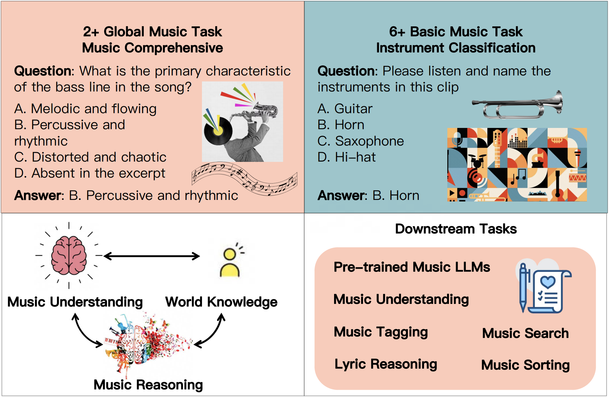

# MuCUE-Bench

<div align="center">
    <a href="https://arxiv.org/abs/2508.01178"></a>
    <a href="https://huggingface.co/datasets/Yi3852/MuCUE"></a>
</div>




## Overview

| tasks                     | dataset                                                  | duration_mean |
|:---------------------------|:----------------------------------------------------------|:---------------|
| key identification        | gs_key, gs_key_30s, gtzan_key                            | 57.9          |
| pitch identification      | nsyn_pitch                                               | 4.0           |
| chord identification      | guitarset                                                | 2.5           |
| rhythm identification     | ballroom_tempo, gtzan_tempo                              | 30.0          |
| instrument classification | ins_cls, nsyn_ins, mtg_ins                               | 75.6          |
| genre classification      | gtzan, fma-small, fma-medium, mtg_genre, ballroom_genres | 61.7          |
| mood identification       | mtg_mood, md4q                                           | 91.0          |
| structure analysis        | salami_segd, salami_pred, salami_cnt, salami_overall     | 263.9         |
| lyrical reasoning         | ly_m163                                                  | 206.0         |
| comprehensive             | mmau-music, tat, mucho, mcaps, mqa_m163                  | 67.3          |

## Evaluation Instruction

note: below scripts will automatically download the whole dataset from huggingface(around 25GB)

```bash
# 1. generate response on all eval sets for a model, stored as jsons in outputs folder
# for different models see below
# the choice for model name is arbitrary, which will only affect the output json file name
# you can directly modify the value of data_names in gen_answers function(scripts/eval_single.py) to generate answers for only the desired eval sets

python scripts/api_model.py --model model_name_you_prefer
# for Kimi-Audio go to https://github.com/MoonshotAI/Kimi-Audio and follow the installation instructions there
python scripts/kimia.py --model model_name_you_prefer

python scripts/mufun.py --model model_name_you_prefer
# for vllm models before running you have to start a server, for instance: 
# vllm serve Qwen/Qwen2.5-Omni-7B  --trust_remote_code --dtype bfloat16
# vllm serve Qwen/Qwen2-Audio-7B-Instruct  --trust_remote_code --dtype bfloat16 --chat-template-content-format string
python scripts/vllm_model.py --model model_name_you_prefer

# 2. extract the choices(A, B, C, D) from the response jsons and store back, then calculate the accuracy for each eval sets
# extration requires a text LLM, before running this step, start a server: vllm serve Qwen/Qwen3-8B --port 8008
# you can also modify the code to use other local or api models
# see extract_single.py, eval_single.py for single-task evaluation
python scripts/extract_eval.py --model model_name_you_prefer

# see scripts/table_acc.ipynb to get the accuracy table for different models you have evaluated
```

## Metadata

total samples for evaluation: 16463
total samples of all: 1782077

| data_name       | eval_num | total_num | audio_duration     | source                                     | notes               |
|:-----------------|:----------|:-----------|:--------------------|:--------------------------------------------|:---------------------|
| ballroom_genres | 698      | 698       | 30s                | Ballroom                                   |                     |
| ballroom_tempo  | 698      | 698       | 30s                | Ballroom                                   |                     |
| fma-small       | 500      | 8000      | 30s                | Free Music Archive (FMA)                   |                     |
| fma-medium      | 500      | 25000     | 30s                | Free Music Archive (FMA)                   |                     |
| gs_key          | 604      | 604       | 2min               | GiantSteps (key)                           |                     |
| gs_key_30s      | 500      | 3612      | 30s                | GiantSteps (key)                           |                     |
| gtzan           | 999      | 999       | 30s                | GTZAN                                      |                     |
| gtzan_key       | 836      | 836       | 30s                | GTZAN                                      |                     |
| gtzan_tempo     | 999      | 999       | 30s                | GTZAN                                      |                     |
| guitarset       | 500      | 4320      | <15s               | guitarset                                  |                     |
| ins_cls         | 500      | 42311     | 3s                 | Music Instrument Sounds for Classification |                     |
| ly_m163         | 500      | 9959      | <10min             | NetEase Cloud Music                        | proprietary         |
| mcaps           | 500      | 10937     | 10s                | MusicCaps                                  |                     |
| md4q            | 900      | 900       | 30s                | MOODetector:4Q audio emotion               |                     |
| mmau-music      | 334      | 334       | 10-30s             | MMAU                                       | v05.15.25 test-mini |
| mqa_m163        | 500      | 10957     | <10min             | NetEase Cloud Music                        | proprietary         |
| mtg_genre       | 500      | 133102    | filtered to <10min | MTG-Jamendo                                |                     |
| mtg_ins         | 500      | 63753     | filtered to <10min | MTG-Jamendo                                |                     |
| mtg_mood        | 500      | 32117     | filtered to <10min | MTG-Jamendo                                |                     |
| mucho           | 1184     | 1184      | 2min, 10s          | MuChoMusic                                 |                     |
| nsyn_ins        | 500      | 289205    | 4s                 | NSynth                                     |                     |
| nsyn_pitch      | 500      | 289205    | 4s                 | NSynth                                     |                     |
| salami_segd     | 500      | 3772      | filtered to <10min | SALAMI                                     |                     |
| salami_pred     | 500      | 3354      | filtered to <10min | SALAMI                                     |                     |
| salami_cnt      | 831      | 831       | filtered to <10min | SALAMI                                     |                     |
| salami_overall  | 380      | 380       | filtered to <10min | SALAMI                                     |                     |
| tat             | 500      | 844010    | 29s                | MagnaTagATune                              |                     |

## Leaderboard

units: Acc%

|                 | gemini | Qwen2.5-Omni-7B | Kimi-Audio-7B-Instruct | Qwen2-Audio-7B-Instruct | MuFun(ours)  |
|:-----------------|:--------|:-----------------|:------------------------|:-------------------------|:-------|
| ly_m163         | 88.2   | 87.4            | 87.0                   | 60.0                    | 90.8  |
| ins_cls         | 26.0   | 66.8            | 79.4                   | 39.8                    | 91.2  |
| gs_key_30s      | 33.6   | 23.8            | 26.0                   | 18.2                    | 50.4  |
| mmau-music      | 67.1   | 63.8            | 66.2                   | 57.8                    | 66.5  |
| salami_segd     | 40.6   | 18.6            | 27.2                   | 19.4                    | 64.8  |
| salami_overall  | 62.1   | 55.8            | 45.3                   | 42.6                    | 48.7  |
| fma-medium      | 62.8   | 78.0            | 59.8                   | 77.0                    | 85.2  |
| mtg_mood        | 38.2   | 43.4            | 39.4                   | 29.2                    | 52.8  |
| nsyn_pitch      | 30.8   | 36.8            | 31.8                   | 31.2                    | 77.2  |
| guitarset       | 25.2   | 13.2            | 27.2                   | 19.2                    | 58.8  |
| mucho           | 69.6   | 66.5            | 69.7                   | 66.7                    | 63.9  |
| salami_pred     | 37.6   | 32.2            | 34.6                   | 31.2                    | 64.8  |
| fma-small       | 63.4   | 66.2            | 55.8                   | 65.6                    | 72.4  |
| salami_cnt      | 49.8   | 36.8            | 37.8                   | 30.2                    | 43.2  |
| gtzan_tempo     | 41.3   | 32.4            | 22.9                   | 27.1                    | 40.7  |
| nsyn_ins        | 32.4   | 40.6            | 44.4                   | 22.4                    | 74.0  |
| mcaps           | 62.2   | 65.6            | 68.0                   | 74.0                    | 80.0  |
| mqa_m163        | 58.0   | 76.0            | 79.0                   | 60.8                    | 88.4  |
| gtzan_key       | 33.7   | 28.7            | 28.3                   | 22.0                    | 34.1  |
| ballroom_genres | 57.0   | 45.8            | 44.0                   | 35.2                    | 52.4  |
| gtzan           | 72.2   | 88.6            | 77.8                   | 83.9                    | 81.3  |
| ballroom_tempo  | 31.7   | 28.9            | 24.4                   | 31.1                    | 29.4  |
| tat             | 61.2   | 59.4            | 54.0                   | 61.4                    | 80.6  |
| mtg_genre       | 57.2   | 61.6            | 55.8                   | 46.4                    | 81.4  |
| md4q            | 71.9   | 47.6            | 61.3                   | 57.8                    | 65.9  |
| mtg_ins         | 19.8   | 55.8            | 51.2                   | 24.0                    | 68.6  |
| AVG             | 49.8   | 50.8            | 49.9                   | 43.6                    | 65.7  |
